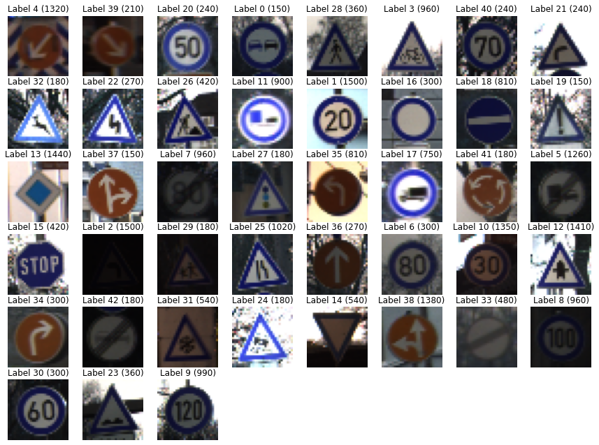
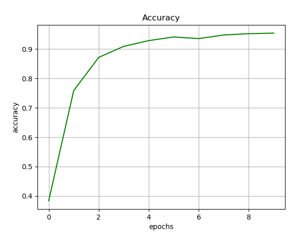
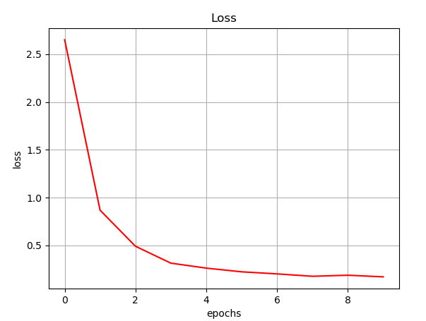

# Traffic Sign Recognition using Convolutional Neural Network (CNN)


In this project, we build a deep neural network model that can classify signs present in the image
into different categories. With this model we are able to read and understand traffic signs which are a very
important task for all autonomous vehicles. The classification of objects is implemented using convolutional
neural networks (CNNs). After model training the algorithm shows the final results of more than 97%
accuracy of traffic sign recognition. The dataset [German Traffic Sign Dataset](https://benchmark.ini.rub.de/gtsrb_news.html), which is uploaded in gtsrb directory, is
used for training and testing the developed model.


### 1. Dependencies & environment

* Install Python v3.4, v3.5, or v3.6. I used v3.6
* Create a Virtual environment with one of mentioned python versions.
* Install NumPy, Matplotlib, scikit-learn, TensorFlow, OpenCV.
* Windows 10 Operating System (Should work on other platforms as well).

### 2. How to run the code
* Activate the environment:
```sh
path_to_your-python-environment:/ activate 
```
* Run the project:
```sh
python traffic.py gtsrb model.h5
```
### 3. Outputs
#### Dataset Preview
The resized images and the labels of the dataset.



#### Model Architecture
```sh
model = get_model()
model.summary()
```
The model has 3 Conv2D layers, 3 MaxPooling2D layers to reduce the spatial dimensions of the Conv2D layers, one Flatten layer to flatten or unroll the 3D output to 1D, one Dropout layer for regularization and one Dense or output layer. 
```sh
Model: "sequential"
_________________________________________________________________
Layer (type)                 Output Shape              Param #
=================================================================
conv2d (Conv2D)              (None, 28, 28, 32)        896
_________________________________________________________________
max_pooling2d (MaxPooling2D) (None, 14, 14, 32)        0
_________________________________________________________________
conv2d_1 (Conv2D)            (None, 12, 12, 64)        18496
_________________________________________________________________
max_pooling2d_1 (MaxPooling2 (None, 6, 6, 64)          0
_________________________________________________________________
conv2d_2 (Conv2D)            (None, 4, 4, 128)         73856
_________________________________________________________________
max_pooling2d_2 (MaxPooling2 (None, 2, 2, 128)         0
_________________________________________________________________
flatten (Flatten)            (None, 512)               0
_________________________________________________________________
dropout (Dropout)            (None, 512)               0
_________________________________________________________________
dense (Dense)                (None, 43)                22059
=================================================================
Total params: 115,307
Trainable params: 115,307
Non-trainable params: 0
```

#### Model Training
```sh
model.fit(x_train, y_train, epochs=EPOCHS)
model.evaluate(x_test, y_test, verbose=2)
```
After successful training, the accuracy is computed using all images from the test dataset in 10 iterations. The classification accuracy grows and loss decreases with increasing the number of training iterations. The result shows that the network reaches the classification accuracy above 97% and the loss below 0.
```sh
Epoch 1/10
500/500 [==============================] - 8s 14ms/step - loss: 4.9845 - accuracy: 0.2062
Epoch 2/10
500/500 [==============================] - 181s 364ms/step - loss: 1.1079 - accuracy: 0.6811
Epoch 3/10
500/500 [==============================] - 7s 15ms/step - loss: 0.5455 - accuracy: 0.8435
Epoch 4/10
500/500 [==============================] - 7s 14ms/step - loss: 0.3638 - accuracy: 0.8940
Epoch 5/10
500/500 [==============================] - 7s 14ms/step - loss: 0.2547 - accuracy: 0.9280
Epoch 6/10
500/500 [==============================] - 7s 14ms/step - loss: 0.2384 - accuracy: 0.9321
Epoch 7/10
500/500 [==============================] - 7s 15ms/step - loss: 0.2216 - accuracy: 0.9390
Epoch 8/10
500/500 [==============================] - 7s 14ms/step - loss: 0.2060 - accuracy: 0.9434
Epoch 9/10
500/500 [==============================] - 7s 14ms/step - loss: 0.2094 - accuracy: 0.9421
Epoch 10/10
500/500 [==============================] - 7s 15ms/step - loss: 0.1522 - accuracy: 0.9573
333/333 - 2s - loss: 0.0669 - accuracy: 0.9831
```

Visualization of Accuracy and Loss:
<div> 

</div>

### 4. Release History

* 0.1.0
    * Initial release: 
      * Loading the data.
      * plotting some sample images of dataset.
      * initializing, training and evaluating the CNN model.
      * Plotting the accuracy and loss of model
    * Date 6 January 2021
    
### 5. By
#### Sadaf Waziry & Ahmad Bilal Wardak - January 2021
